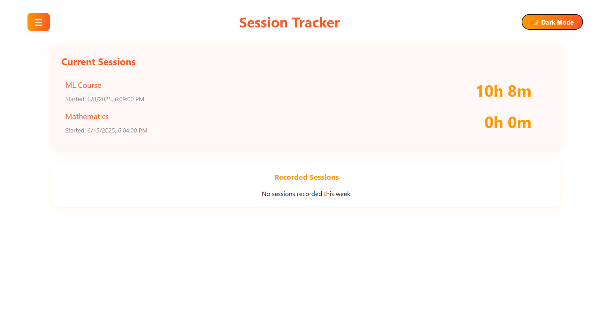
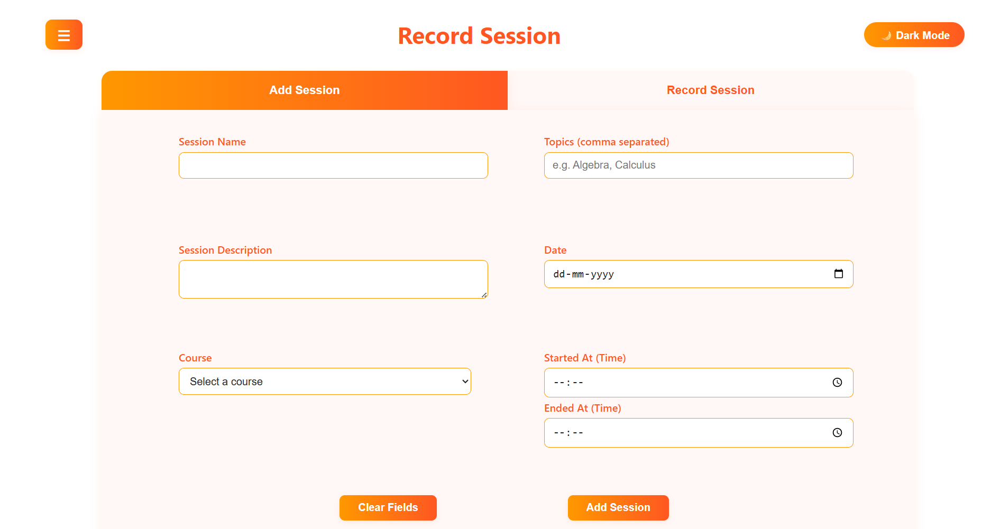
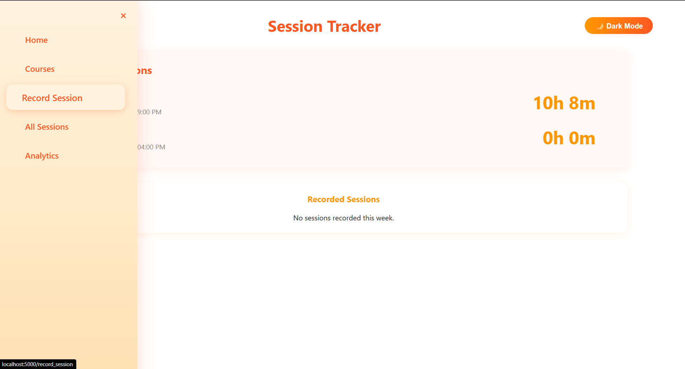
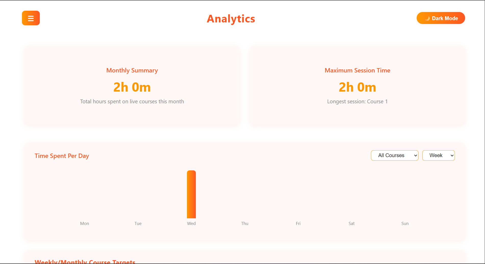

# SessionTracker

This project was made to track the time I spend on each course/project I am currently doing and will do in the future, allowing for better time maagement.

Created to run locally with a .exe launcher.

I will be able to Add courses/projects and add sessions for each. Have an analytics page that gives monhly summary.

